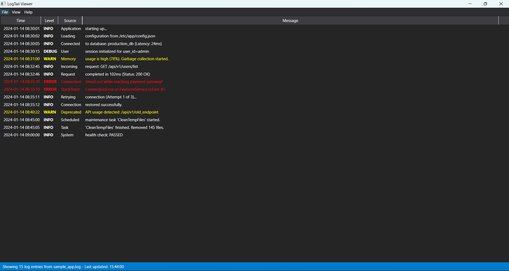

# LogTail

A modern, feature-rich log file viewer for Windows with Visual Studio integration.

## Features

- **Real-time Log Monitoring**: Automatically refreshes and displays the latest log entries
- **Advanced Filtering**: Filter by log level (Verbose, Debug, Info, Warning, Error, Fatal), source, and custom text
- **Visual Studio Integration**: Double-click on stack traces to open files directly in Visual Studio at the specific line
- **Smart Clipboard**: Copy entire log entries including multi-line stack traces with a double-click
- **Recent Files**: Quick access to recently opened log files
- **Color-Coded Levels**: Visual distinction between different log levels
- **Structured Log Parsing**: Automatically parses timestamp, level, source, and message components

## Screenshots

### Main Screen

### Settings Dialog

### Main Window
The application displays logs in a clean, Visual Studio-inspired dark theme with automatic column sizing.

### Visual Studio Integration
Double-click any line containing a file path (e.g., `at Method() in C:\Path\File.cs:line 123`) to open the file in Visual Studio at the exact line number.

## Installation

### Prerequisites

- Windows 10 or later
- .NET 10 Runtime
- Visual Studio 2022/2025/2026 (optional, for IDE integration features)

### Download

Download the latest release from the [Releases](https://github.com/hansos/logtail/releases) page.

### Building from Source

## Usage

### Opening Log Files

1. Launch LogTail
2. Click **File > Open Log File** or use the recent files menu
3. Select your `.log` file or any text file

The application will automatically load the last 100 lines and refresh every 2 seconds.

### Filtering Logs

1. Click **View > Filter**
2. Configure filters:
   - **Log Levels**: Check/uncheck log levels to show
   - **Sources**: Filter by specific log sources
   - **Text Filter**: Search for specific text in messages
   - **Refresh Rate**: Adjust auto-refresh interval (1-60 seconds)
   - **Tail Lines**: Number of lines to display (10-10000)

### Visual Studio Integration

When you double-click a log entry containing a file path pattern like:
- `in C:\Path\File.cs:line 123`
- `at Namespace.Class.Method() in C:\Path\File.cs:line 123`

LogTail will:
1. Try to connect to a running Visual Studio instance via DTE COM automation
2. Open the file and navigate to the specific line
3. If no instance is running, launch Visual Studio with the file

### Copying Log Entries

Double-click any log entry with a timestamp to copy it to the clipboard. The tool automatically includes all following lines without timestamps (multi-line stack traces, etc.).

## Supported Log Formats

LogTail parses various log formats. Example:

## Keyboard Shortcuts

- **Ctrl+O**: Open log file
- **F5**: Refresh now
- **Ctrl+F**: Open filter dialog

## Contributing

Contributions are welcome! Please see [CONTRIBUTING.md](CONTRIBUTING.md) for guidelines.

## License

This project is licensed under the MIT License - see the [LICENSE](LICENSE) file for details.

## Roadmap

- [ ] Support for other IDEs (VS Code, Rider)
- [ ] Export filtered logs
- [ ] Custom color themes
- [ ] Log file monitoring with change notifications
- [ ] Support for compressed log files (.gz, .zip)
- [ ] Regular expression filters
- [ ] Bookmarks and annotations
- [ ] Allow custom log formats via configuration
- [ ] Store application settings between sessions

## Acknowledgments

- Built with WPF and .NET 10
- Inspired by classic Unix `tail` command
- Visual Studio integration via DTE automation

## Support

- **Issues**: [GitHub Issues](https://github.com/hansos/logtail/issues)
- **Discussions**: [GitHub Discussions](https://github.com/hansos/logtail/discussions)
- **Releases**: [GitHub Releases](https://github.com/hansos/logtail/releases)

---

Made with ❤️ for developers who read logs